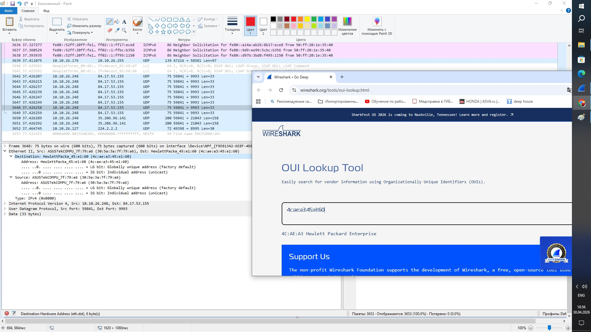

# Задание 1 (Ethernet)

Выберите несколько пакетов из захваченного трафика;
Откройте уровень Ethernet;
Определите по MAC-адресу нескольких производителей сетевого оборудования.
Приведите ответ в свободной форме.

Первые 3 байта (старшие 24 бита) —  OUI (Organizationally Unique Identifier), уникальный идентификатор организации, который выдаётся производителю оборудования.
В данном примере у меня HP.

Задание 2 (IP)

Выберите несколько пакетов из захваченного трафика;
Откройте уровень IP;
Какие флаги протокола IP вам удалось обнаружить?
Приведите ответ в свободной форме.

Задание 3 (TCP, UDP)

Выберите несколько** UDP** (DNS или мессенджеры) и TCP (http) пакетов из захваченного трафика;
Откройте уровень TCP\UDP;
Сравните пакеты TCP и UDP между собой. В чём отличия?
Приведите ответ в свободной форме.

Задание 4 (HTTP)

Перейдите на сайт kremlin.ru;
Выберите любой http-поток (через меню, открывающееся по нажатию правой кнопки мыши, - следовать - поток HTTP);
Какой поток у вас открылся на самом деле (посмотрите в строке ввода фильтров)? Почему?
Приведите ответ в свободной форме.
